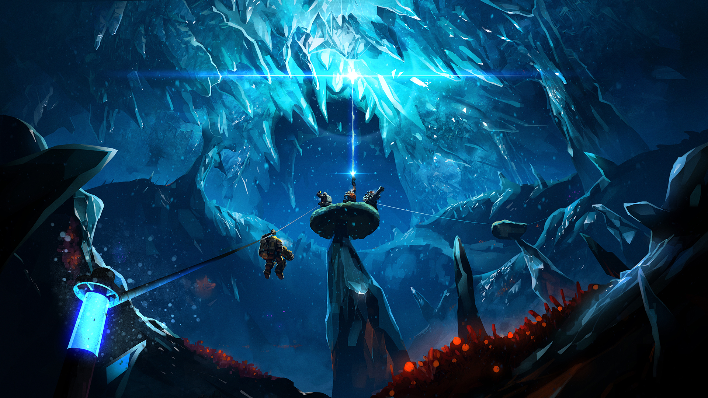

# DRG Tips & Tricks

I made this list to organize all the tips & tricks I’ve discovered or collected over time. I added sources/examples for anything that isn’t easily verifiable in-game.

I’ve tried to make these tips general to all platforms, but my only experience is on PC. If there’s something console-related I should add, let me know.

A few of these will be marked with a question mark [?]. This means that I’ve heard about it or seen it somewhere, but haven’t been able to fully verify it for myself yet.

Lastly, there’s plenty of build advice to give in this game, but builds are pretty subjective and often come down to personal preference, so I won’t talk about specific builds here.

	

## General tips

These are things everyone should know and can use all the time.

Click to expand

* The [DRG wiki](https://deeprockgalactic.wiki.gg/wiki/Deep_Rock_Galactic_Wiki) is an amazing source of information. Use it as much as possible!

* Hit Tab or M to access the mission map from anywhere in the space rig.

* Ping minerals or dirt to have Bosco mine it. Bosco can also mine & carry heavy objects like aquarqs or enor pearls, provide light if you ping on non-minerals, and attack enemies that you ping.

* Shout (press x) to call bosco to you - if he is holding a heavy object, he will drop it, or throw it at you if he's within 10m of you. If he’s mining or shining a light, he will also stop and go to you.

* Use your terrain scanner to see which way to dig through dirt.

* If you ping a large object (like enor or jadiz), Bosco will pick it up and carry it to you.

* If you see something and don’t know what it is, point your laser pointer at it. It’ll show the name of that thing and you can look it up. Google and the Wiki are your friends.

* When you throw a flare, it inherits your momentum. If you want to throw a flare as far as possible, sprint, jump, and throw throw the flare immediately after starting the jump.

* On refinery missions, ping a pipeline (that has already been laid) to make bosco build it or repair it.

* Ping the drilldozer or HACK-C to make bosco prioritize defending them.

* On drilldozer missions, in the last phase of the ommoran heartstone fight, ping the tips of laser beamers to have Bosco mine them.

* Ctrl+e sets a permanent waypoint that stays on your terrain scanner, and is visible when you pull out your laser pointer

* The terrain scanner is useful for finding many things - your teammates, alien eggs, dreadnought cocoons, the MULE, black boxes, mini MULEs, and large objects such as jadiz, enor, aquarqs, etc. It even shows the ghost bulk detonator and the nemesis.

* Minerals in your bag do not need to be deposited at the end of a mission (large minerals like enor and secondary objectives like apoca blooms still do).
  * While you will get credits from gold, and you will keep the minerals, you won’t get XP from undeposited minerals.

* Press space while using the terrain scanner to turn your dwarf in the direction of the scanner.

* During extraction, the MULE leaves behind green beeping markers that show where it went. The markers also show up on the terrain scanner. Follow them if you get lost.

* Always look up when entering a new cave so you don’t get leeched.

* Everyone gets the same rewards at the end of the mission. It isn’t split up.

* Dwarf survival only affects credits, not xp. Sometimes you might have to leave someone behind to ensure the mission succeeds.

* Use the in-game miner's manual to find which region has which resources and what they look like (and whether the minerals are abundant/scarce). Use the in-game bestiary to look at enemies and their strengths/weaknesses.

* Swarms and waves have different mechanics based on mission type. Waves are smaller, unannounced swarms.
  * Mining: swarms happen over time.
  * Egg hunt: Each egg pulled has a chance to spawn a swarm. If it doesn't spawn a swarm, it spawns a wave. You are guaranteed a specific number of swarms based on the number of eggs. 4 eggs = 1 swarm, 6 eggs = 2 swarms, 8 eggs = 3 swarms.
  * Salvage: Coming within 2 meters of a Mini-M.U.L.E. for the first time will trigger a medium to large sized wave of enemies after 12 to 30 seconds, tending towards 15-18 seconds. Another, smaller wave of enemies will spawn when one of the legs that are found near each Mini-M.U.L.E. is dug out. This leg is picked randomly. [Source](https://deeprockgalactic.wiki.gg/wiki/Salvage_Operation)
  * Point extraction: swarms happen over time (roughly every 5 minutes). Over time, swarms increase in size, and more enemies will spawn in waves in-between swarms.
  * Elimination: no swarms, just waves. No waves spawn during a dreadnought fight. However, mactera plague, swarmageddon, and rival presence waves still happen during the fight (thanks u/GeddaBolt).

* Back up while channeling Beastmaster to avoid being attacked.

* Steeve (the pet from the Beastmaster perk) glows blue so you know to avoid shooting it. Steeve is affected by mission mutators, e.g. regenerative bugs.

* Turn off your flashlight (hold F) to find minerals hidden in walls, e.g. jadiz or aquarqs.

* Hold h to turn off your HUD (good for taking screenshots).

* Hit A or D to change class in the loading screen. Doesn’t work if you’re the host, or if the host turned off class duplication.

* You can mine gold and other minerals by digging out all the terrain connected to it. This is useful for ground minerals like hollomite, umanite, and magnite, where you only need to mine the bottom parts of these.

* Click twice on the loadout letter to set an icon to it. [Example](https://www.reddit.com/r/DeepRockGalactic/comments/lcoehe/til_you_can_click_a_second_time_on_the_loadout/)

* [On Xbox] Click L3 while walking backwards to spin 180 degrees.

* Cargo crates have a varying chance to spawn based on mission type and length (varies from 7% to 15%). The batteries always spawn in a set radius (30m) of the crate. [Source](https://deeprockgalactic.wiki.gg/wiki/Cargo_Crate)

* Lost packs have the same chance to spawn as a cargo crate (see above). Scanning the lost helmet will mark your terrain scanner with a pink star. [Source](https://deeprockgalactic.wiki.gg/wiki/Lost_Pack)

* If you’re thinking of going up a hazard level, take a look at the [difficulty scaling](https://deeprockgalactic.wiki.gg/wiki/Difficulty_Scaling). Based on the hazard level, enemies will scale in quantity, movement speed, damage, attack speed, and for larger enemies, effective health.

* You can’t resupply past your max ammo, so try to use your weapons evenly so you get more out of a resupply. Otherwise you’re wasting ammo.

* If you try to join a mission and it says "JOIN FAILED", hit esc rather than clicking "cancel" so that your lobby doesn't reload.

* Stand on the MULE to mine higher up (you can also ride the MULE to the drop pod).

* Look for colorful markings sticking out of walls to find heavy minerals. Some examples: [jadiz](https://github.com/CupNoodles27/DRG-Tips-and-Tricks/blob/main/images/jadiz.jpg), [enor pearl](https://github.com/CupNoodles27/DRG-Tips-and-Tricks/blob/main/images/enor.jpg), [compressed gold](https://github.com/CupNoodles27/DRG-Tips-and-Tricks/blob/main/images/gold.jpg). Also applies to [aquarqs](https://github.com/CupNoodles27/DRG-Tips-and-Tricks/blob/main/images/aquarq.jpg), [bittergems](https://github.com/CupNoodles27/DRG-Tips-and-Tricks/blob/main/images/bittergem.jpg), and [error cubes](https://github.com/CupNoodles27/DRG-Tips-and-Tricks/blob/main/images/error_cube.jpg).
  * These things glow as long as the heavy object is nearby. If they’re dark and not glowing, the heavy object has been mined and moved somewhere else. Compressed gold seems to be an exception to this - its glow doesn’t seem to change.

* If you need to get rid of beer that you’re holding, change classes.

* Buy all the upgrades for your armor, you’ll get permanent health bonuses.

* On shield disruption missions, make sure to take the health upgrade on your armor.

* On missions where you need to stand inside a zone, such as for the uplink and fuel cells on salvage operations, the speed at which the bar progresses scales linearly with the number of dwarves. So if you're in a team of 4, having all 4 people in the zone makes the bar progress at 100% speed; uplinks take 80 seconds while fuel cells take 100 seconds. But if you have 3 dwarves inside and 1 outside, the bar progresses at 75% speed; uplinks take 107 seconds while fuel cells take 133 seconds.

## Intermediate tips

These tips are useful once you’ve got the basics down.

Click to expand

* Cancel all your reload animations by hitting the button for your laser pointer. Hitting your pickaxe button to cancel also works, but will stop your sprint if you're on the ground. If you’re in the air, both techniques work the same. You can also cancel by switching weapons.
  * The faster your reload, the less time you save by reload canceling (you also save a smaller percentage of time). Keep that in mind when you’re thinking of taking a reload speed upgrade. [Source](https://www.youtube.com/watch?v=TQ0-ysX-ZX4)
* Cancel grenade animations the same way. Useful if you need to throw multiple axes. As soon as the grenade leaves your hand, cancel the animation.
  * Frozen oppressors (on haz 5 with 4 players) take 2 axes to kill from full health, but they unfreeze quickly. Without animation canceling you can’t hit an oppressor with 2 axes before it unfreezes; with animation canceling, you can.

* Grenades inherit your momentum, just like flares. Sprint and jump to throw grenades further.

* Cancel your power attack wind down animation by releasing the power attack button right after the power attack hits. Make sure to release the pickaxe button *afterwards*. [Example](https://imgur.com/a/9V7WnzR)

* Cancel flare gun and platform gun firing animations to fire faster. Fire then immediately hit your pickaxe/laser, then repeat.

* Look for flares on the ground to see whether you or a teammate have already explored an area.

* The terrain scanner can also indicate whether you or a teammate have been to an area; if the scanner shows terrain in an area, it means someone has been there. If it doesn’t, then nobody has.

* Jump before opening your terrain scanner so you retain a bit of momentum rather than stopping.

* Frozen enemies take 3x damage (although explosive damage is not multiplied). Frozen dreadnoughts take 2.66x damage (not 2.5x damage, unlike what the wiki says).

* Frozen wardens don’t grant their allies the half-damage and regeneration buffs. The same applies to korlok healing pods, which will not heal the korlok when frozen.

* Wardens will occasionally stop and scream, after which some grunts are spawned near it. Stunning, freezing, or fearing the warden during the scream channel will cancel the grunt summons.

* Macteras and swarmers instantly die after being frozen. Importantly, this includes naedocyte breeders. However, goo bombers are difficult to freeze.

* If you pop both sacs on a goo bomber, it will no longer create goo, and it won't spew goo on the ground when it dies.

* Spider webs can be burnt/removed by hitting them with the flamethrower, EPC, impact axes, DRAK, shard diffractor, breach cutter, incendiary grenades, or the boomstick with white phosphorus shells.

* Many enemies are resistant to some damage types and weak against others. The strengths and weaknesses for every creature can be found [here](https://deeprockgalactic.wiki.gg/wiki/Creatures). These can be very useful to know so you don’t waste ammo. For example, oppressors take 50% increased melee damage, making axes and power attacks better against them. Oppressors also take 66% reduced fire damage, so flamethrowers are less effective.
  * Something else you may not find on the above list are freezing/fire temperatures - the temps at which an enemy gets frozen or set on fire. For example, on the [praetorian](https://deeprockgalactic.wiki.gg/wiki/Glyphid_Praetorian) page, you’ll find that regular praetorians freeze at -150 degrees, while frost praetorians freeze at -250 degrees.

* Cancel the pickaxe swinging animation by releasing the pickaxe button as soon as it hits something, then holding the pickaxe button again. This lets you at take at least 4.5% less time to mine if you do it perfectly - [source](https://youtu.be/G0AgAVRCo1U). Could be even faster, I did not test this much and was a bit rusty when I did test it. This trick is significantly more useful when pickaxing things like enemies and ebonuts, since your pickaxe slows down a lot when hitting those.

* Bunny hopping: Jump and fire to preserve your momentum while firing. Useful for gunner because his weapons slow him down. If you were sprinting before the jump and stop firing before you land, you will keep sprinting.

* You can check your team’s ammo levels by hitting the laser pointer and looking at the four bars under their health bars. Use this to guide whether you decide to order a resupply.

* Minigun and Zhukov both use 2 ammo per shot. Keep that in mind when making builds and calculating damage numbers.

* If you have an odd amount of max ammo, the ammo you get from a resupply rounds up to the nearest whole number. For example, if you have 15 PGL shots, resupplies give you 8. There is one exception - if you have 3 max satchel charges, a resupply will only give you 1.

* If you move next to the purple swarmer tunnels, several groups of swarmers will spawn there shortly afterwards. If you have area damage, you can spawncamp the swarmers.

* After depositing something, once you're done depositing and are putting your bag down, manually pull out a weapon to cancel the animation.

* When depositing minerals, repeatedly hit your deposit button and cancel the deposit to deposit faster. Easiest to just spam the deposit button and pickaxe at the same time. You can also just scroll your mouse wheel instead of spamming the pickaxe.

* If you freeze BET-C’s weakpoints (with cryo cannon or cryo grenade), it will take triple damage while it’s “frozen”, although it will still be able to move and attack.

* Blowthrough can let you hit both parts of a hostile BET-C, and it will also let you shoot through BET-C and hit bugs behind it.

* Stunning BET-C will cause it to change weapons (between the bombs and the gun).

* Blowthrough lets you shoot through the MULE.

* Enemies that have after-death effects won't do them if they die while frozen. So frozen exploders, bulk detonators, praetorians, oppressors, and nexuses won't explode/release gas/release swarmers when they die.

* Some enemies have breakable weakpoints (i.e. goo bombers and bulk detonators). Area damage can break these weakpoints, but will not benefit from the bonus weakpoint damage. So use direct damage on them first.

* Some enemies have 1x weakpoints: praetorians, oppressors, backs of dreadnought twins (once the armor is destroyed), and caretaker eyes. Weapons with weakpoint damage bonuses benefit from hitting 1x weakpoints.

* Applying cold to a burning enemy or heating up a frozen enemy enough to remove the status effect (on fire or frozen) will deal 200 disintegrate damage - [Temperature shock](https://deeprockgalactic.wiki.gg/wiki/Status_Effects#Temperature_Shock)
  * Unfreezing a frozen enemy can often be bad, since frozen is such a powerful status effect. For example, if a brood nexus is frozen, it’ll take 3x damage, and it won’t spawn swarmers if it dies while frozen.

* Praetorians and oppressors won’t release gas if killed by [disintegrate damage](https://deeprockgalactic.wiki.gg/wiki/Damage#Disintegrate). Hyper propellant converts all direct damage to disintegrate damage, so a praetorian killed by the direct damage from a hyper propellant shot won't release gas. Disintegrate does not affect the after-death effects of exploders/bulks.

* Heat can explode praetorian/oppressor gas and neurotoxin grenades. Many weapons can do this:
  * Flamethrower
  * EPC with plasma burn
  * DRAK with thermal exhaust feedback or aggressive venting
  * Boomstick with white phosphorous
  * Minigun with hot bullets, aggressive venting, or burning hell
  * Incendiary grenade
  * PGL with incendiary compound
  * Breach cutter with inferno
  * Shard Diffractor
  * Coilgun with Hellfire
  * Environmental hazards in the Magma Core

* In the Fungus Bogs, pickaxe at the root of the vines that hang from the ceiling to remove them from obstructing your view.

* You can detect cave leeches on the terrain scanner by looking for small holes in the ceiling.

* Pickaxe a frozen dwarf to help unfreeze them. Power attack to instantly fully unfreeze them. Drills ccan also help unfreeze but will damage your teammate in the process.
  * With precise timing, you can powerattack and unfreeze yourself. [Example](https://www.reddit.com/r/DeepRockGalactic/comments/11drbrf/unfroze_myself_with_a_perfectly_timed_power_attack/)

* Every mission has a set spawn pool. Any enemy included in the spawn pool can be spawned, any enemy not in the spawn pool won’t be. So if you see one leech, look out for more.
  * A spawn pool can have up to 3 “disruptive enemy” types. The following are disruptive enemies: detonators, shellbacks, goo bombers, grabbers, menaces, and wardens. So if you see a goo bomber, grabber, and shellback, you have no chance of getting a bulk. [Source 1](https://devtrackers.gg/deep-rock-galactic/p/f901d71e-lets-talk-about-bulk-detonators-in-salvage-missions), [Source 2](https://www.reddit.com/r/DeepRockGalactic/comments/qs8l4t/enemies_and_how_they_spawn_what_secrets_do_you/hkbjqbg/)
  * There are a lot more spawn mechanics, here is an [in-depth video](https://youtu.be/tLiX_GJRdWw) on spawn pools.

* Look out for visuals of falling chunks dirt/rocks, it can indicate that enemies are spawning nearby. Note that silicate harvesters make the same effect, so don’t get bamboozled.

* Mine out the terrain connected to oil shale to knock it all down. Loose oil shale is picked up much more quickly by the fuel canister. You can also use the EPC, C4, or Fat Boy to quickly mine oil shale.

* Kursite will disappear if not deposited quickly enough.

* Lure a Crassus detonator into a small tunnel to get more gold when it explodes. The driller can make this tunnel anywhere. If done right, you’ll get up to around 1230 gold. [Source](https://deeprockgalactic.wiki.gg/wiki/Glyphid_Crassus_Detonator)
  * Crassus detonators can only spawn (with a 3% chance) when the map is generated. They will not spawn afterwards.
  * If you shoot some platforms at the edge of the explosion radius, the Crassus explosion can make gold from those platforms.

* Every five OCs you forge adds 1 to your Forge level and gives you a free OC. Assuming you forge every OC, you’ll run out of OCs to get/forge at forge level 93.

* Deep Dive missions are hazard level 3/3.5/3.5, and are guaranteed to have 2 warnings in total. Elite Deep Dive missions are hazard level 4.5/5/5.5 and will have 2-3 warnings in total.

* Gold is worth 3.5 credits on Deep Dives and 4.5 credits on Elite Deep Dives. You also don’t get “minerals mined” XP on DD/EDD.

* The DD and EDD for each week are pre-seeded, which means the terrain will all be the same, even if you restart.

* [Buff beer](https://deeprockgalactic.wiki.gg/wiki/Abyss_Bar#Today's_Special) lasts across all three DD/EDD missions.

* Drink a buff beer in your own lobby, then join another lobby to keep that buff.

* Currently buff beer is bugged to apply twice. This means pots o’ gold gives 4x gold rather than 2x, dark morkite gives 1.44x morkite instead of 1.2x, red rock blaster gives 1.69x instead of 1.3x, and so on.

* Pots o' gold and dark morkite only buffs gold mined by the pickaxe, not by bosco, guns, or explosions.

* Ping important enemies (e.g. bulks and prospectors) so you can track where they are. This is especially useful for tracking menaces and dreadnought twins, since your ping stays on them after they burrow and reappear.

* Prospectors are vulnerable to critical weakness, even though most boss enemies aren’t.

* When the dreadnought twins heal, they regenerate their armor and equalize their health - the one with lower gains 3/4 the HP difference, the one with more will lose 1/4 the HP difference. So try to damage them equally to minimize how many times they heal. The twins are guaranteed to heal at least once during the fight, regardless of how evenly you damage them. [Source](https://deeprockgalactic.wiki.gg/wiki/Glyphid_Dreadnought_Twins)

* Once you break the armor on the back of a dreadnought twin, you’ll expose a 1x weakpoint. Also, their lower jaw takes 0.5x damage for some reason.

* If you hit exploders in the face they won't detonate.

* You can grab cave angels to hold onto them and fly. You can steer them as well.

* Jump near the end of a Dash (the perk) to extend the speed boost.

* Grabbing a ledge cancels fall damage. You can fall any distance and survive as long as you grab a ledge.

* If you need to get up a steep slope, run against it and spam jump. This is very useful for getting around.

* If gravity is pulling you down a steep slope, jumping away from the slope will launch you forward. You can practice this with [these windows](https://imgur.com/a/Wq1Jc1V) in the space rig.

* Snow patches and goo patches reduce your fall damage in the same way that engi platforms can do.

* Goo patches significantly slow down ground-based enemies.

* You can’t sprint while on a snow patch. However, the unstoppable perk will let you sprint through snow.

* You only need to pickaxe the middle of green radioactive crystals to disable them.

* The red plant zones with the plants in the Glacial Strata will warm you up and help keep you from freezing. Glacial Strata is the only biome where you do not naturally warm back up - if you gain some cold, it stays until you are frozen or warm up some other way.

* The aquarq station can warm you up if you’re cold. It also warms up enemies, making it harder to freeze them, and making them unfreeze faster. If you’re going to freeze enemies, it can help to lure them away from the aquarq station first.

* If you have a weapon that does heat damage (sets enemies on fire), you can use it on a teammate to prevent them from freezing. Same for weapons that do cold damage on burning teammates. Just make sure they want you to do it first.

* Machine events have a varying chance to spawn based on mission type and length (varies from 15% to 27%). [Source](https://deeprockgalactic.wiki.gg/wiki/Machine_Events)

* Machine events give a decent amount of experience. You don't need to succeed and you'll still get the XP. So even if you can’t do a machine event, start it up for the XP.
  * [?] Some machine events do not need to even run out - you can extract and still get XP. This has happened to me for kursite and tritilyte, and failed for OMEN.

* You can tell beforehand what the OMEN will attack you with by looking at each of the three sections with your laser pointer. The bottom will always be the radial purple lasers. In addition, if you stand on the core infuser (the white thing you put matrix cores in), the OMEN platform opposite from you to the OMEN tower is the one that exposes the radial lasers (the bottom part). Focusing the bottom part is usually the easiest way to defeat the OMEN.
  * The OMEN is the most dangerous machine event. However, it can be made much easier if the engineer prepares well. See the engineer section.

* You take 1% damage when inside the drop pod during extraction.

* Doretta will always go towards exactly 216 on the in-game compass at the top of your screen. If you decide to pre-drill to the heartstone, this can help.

* Doretta moves faster when more dwarves are near it. You should usually try to stay near or on Doretta.

* Doretta does not heal faster when multiple dwarves are repairing her.

* You can repair Doretta from behind (while standing on the ground). This can be useful if you want to repair Doretta during the flying rocks phase.

* All flying enemies instantly die when frozen. This is particularly useful for naedocyte breeders.

* Shellbacks don't stop when frozen, but still take triple damage and can thus be 1-shot with a throwing axe when frozen. Trawlers, flying rocks, BET-C, and Caretaker vents also move normally when frozen, and also take triple damage.

* Press/hold shift while grinding on a pipe to center your view.

* Pickaxe the end of an unfinished pipeline to destroy that part (also works with throwing axes and drills).

* Grinding on a pipe cancels fall damage (hold E while falling on a pipe to grind on it). Same works with ziplines.

* For any action that requires you to hit E (or the equivalent interact button), holding E will let you automatically do that action once it’s possible. For example, holding E will let you revive a teammate as soon as you get in range, or pick up an aquarq as soon as it is mined out.

* Going downhill on a pipeline gives you a lot of momentum, letting you jump off at high speeds. Land back on a pipe after jumping for extra cool points.

* While riding a pipeline, holding E will automatically make you stop at the next section that needs to be built/repaired.

* On salvage missions, each mini mule gives 40-60 nitra and 40-60 gold when repaired. [Source](https://deeprockgalactic.wiki.gg/wiki/Salvage_Operation)

* On salvage missions, check for broken resupply pods by checking your terrain scanner for drill holes in the ceiling.

* Electric crystals in the crystalline caverns can be destroyed by digging out the roots, shooting them a lot, or throwing 7 axes at them.

* Pretty much everything gives a small amount of XP. If you can deposit it, it’ll give you XP. For example, gold gives 2 credits and 1 XP per unit. Nitra gives 1 XP per unit.
  * Calling a resupply will not take away any XP from the 80 nitra that is spent.

* With proper timing, you can sprint -> jump -> grab heavy object (e.g. aquarq) -> charge throw the object -> land. This will let you keep your momentum when throwing the object and keep sprinting afterwards.

* The stat for mining done that you see after a mission depends only on what you deposit, not on what you mine. Minerals in your pocket at the end of a mission also count towards this number.

* Thorns has an internal cooldown of 0.75s. So it's not amazing if there's a ton of swarmers on you. [Source](https://deeprockgalactic.wiki.gg/wiki/Thorns)

* [?] If the hiveguard glitches and won't spawn sentinels, get your whole team to stand around it and melee attack it together to unglitch it. [Source](https://www.reddit.com/r/DeepRockGalactic/comments/sfjl3e/im_lvl_91_and_still_learn_new_things_about_this/huq6gv5/)

* You can permanently destroy spiky vines in the hollow bough by power attacking them. You can still damage them when they retract - use your pickaxe or the drills, since they’re especially weak against melee damage. If you use a conventional weapon, you’ll waste a lot of ammo before the vine is destroyed.
  * If you dig out the terrain from under the root of the vine, it’ll also be destroyed.

* Dig out the terrain from under the root of a stabber vine to destroy it.

* During ebonite machine events, a pickaxe supercharging canister will linger for a short time after being picked up. So after a teammate picks up a canister, if you're quick, you can get the effect from the same canister. [Example](https://www.twitch.tv/videos/1239805870)

* During tritilyte events, hit your laser pointer while holding a bomb to drop it without it exploding.

* A Huuli Hoarder will never escape if you stay near it, regardless of whether or not you are damaging it. The only way to not have it burrow when nobody is near it is to use a weapon that can consistently and continuously stun the Huuli, such as the minigun with T3 stun or the Hurricane with T5 stun. Each stun will only last for a moment ([0.05x the normal duration](https://deeprockgalactic.wiki.gg/wiki/Huuli_Hoarder/Data)) but will prevent the Huuli from burrowing.

* If an exploder starts to explode, it gives a 1.5x speed boost to other exploders within 4.5m. [Video](https://youtu.be/vw0c3KvOiPU) (explanation in description)

## Advanced tips

These are niche/fun tips that you probably won't need.

Click to expand

* [Much easier as host] You can throw grenades/axes much faster than with normal animation canceling. [Source 1](https://www.youtube.com/watch?v=TP0Hp3k_CPE), [Source 2](https://www.reddit.com/r/DeepRockGalactic/comments/ri68mq/instantly_killing_a_dreadnought_twin_with_axe/). There is an easy (cheesy) way to do this; see the “Other guides/info” section of this doc.
  * As of season 2 this became much more difficult for clients to do and requires frame perfect timing from the client.

* You can destroy projectiles from spitballers, korloks, and dreadnought fireballs by shooting the projectiles midair. You can also pickaxe them, drill them, and throw objects into them. [Examples](https://www.reddit.com/r/DeepRockGalactic/comments/sqm0hw/remember_as_driller_you_can_always_fight/hwmlmck/). Fully built turrets can work, but their hitboxes are much smaller now than in the given example.

* Korlok sprouts cannot attack if they are taking consistent damage, such as from an autocannon or from being on fire.

* Enemies can damage other enemies. For example, exploding detonators can instantly kill vulnerable dreadnoughts and vulnerable korloks. If you grapple past a detonator as scout, you can make it stomp on nearby enemies.

* The drilldozer insta kills any vulnerable non-heartstone enemy it drills into.

* For the OMEN event, call a supply drop on a platform to block the heavy burster. This does not block the radial purple lasers. The same applies for the MULE.

* Build a pipeline to stand on / block the OMEN purple lasers. [Example](https://www.reddit.com/r/DeepRockGalactic/comments/t1csbg/i_met_this_engi_who_built_200_iq_pipeline_to/)

* Call the MULE on an OMEN platform and stand on it to avoid the OMEN purple lasers. You can also call a resupply (only on the very center of the OMEN platform) to stand on.

* Removing the terrain from under a honeycomb will instantly kill it (does not work for any other stationary enemies).

* Doretta becomes invincible to all damage for 4 seconds when you repair it to 100% - this can even block detonator explosions. [Example](https://www.reddit.com/r/DeepRockGalactic/comments/t48lca/keep_calm_timed_repair/)

* There are many possible "god spots" where you can stand and enemies won't be able to reach you. This includes standing on brood nexuses and exploding plants. [Video source](https://youtu.be/D6eWGVlvvQI)
  * You can also stand on top of spitballers, although this is more dangerous than standing on a brood nexus.

* Jump on top of the MULE to keep melee enemies from attacking you. This is technically also a "god spot". [Example](https://www.reddit.com/r/DeepRockGalactic/comments/re9men/if_you_didnt_know_jumping_on_the_mule_is_very/)

* You can use Molly to bounce yourself high in the air - [example1](https://www.reddit.com/r/DeepRockGalactic/comments/w2wqqe/ziplines_where_were_going_we_dont_need_ziplines/), [example 2](https://youtu.be/BJAPceNyh04). Call molly, get on top of molly, then jump right as molly stands up. [Multiplayer example](https://www.reddit.com/r/DeepRockGalactic/comments/swyjdy/we_call_it_molly_hopping/)

* Call a supply drop to knock out things in the ceiling, i.e. eggs, aquarqs, or lost packs. Use the permanent waypoint to help line up the drop.

* Stand on a big exploding plant to prevent ground enemies from attacking you. Also works with trees in the fungus bogs and the REZ.

* The bulbs on the purple trees in the fungus bogs glow when shot, and if you get them all to glow at once, they stay lit permanently. [Example](https://www.reddit.com/r/DeepRockGalactic/comments/tzcjel/nice_tip_for_you_scoutless_teams_and_lazy_scouts/)

* Born Ready works while you’re down, so try to switch to a different weapon before going down so you can come back swinging.

* Bounce on your teammates’ heads or on big bugs (e.g. praetorians and dreadnoughts) to avoid fall damage. Useful in a pinch.
  * You can bounce on prospectors.
  * You can also repeatedly bounce on a teammate’s head while they’re going up a zipline. Does nothing but give you cool points.
  * If the teammate jumps right before you hit their head, you’ll get launched further.

* [?] Calling the drop pod after a swarm is announced but before a swarm starts will cancel the swarm.

* No driller on a very vertical pipeline mission? No problem. You can build pipelines vertically by stacking the pipe around and on top of itself in a circle.

* Starting Doretta after refueling will cancel a swarm that’s in progress.

* If both dwarves have the upgrade that gives 6 seconds of invulnerability after a revive, they can chain revive each other.

* [Solo only] If you start performing a task like resupplying, building a pipeline, depositing, and so on, you can open the options menu (esc on PC), then let go of the button for doing that task, then close the options menu. You will keep doing the task without needing to hold down any buttons. [Source](https://www.reddit.com/r/DeepRockGalactic/comments/sniymp/just_a_helpful_tipglitch/)

* The batteries that you eject to start the Caretaker fight can explode. Put a battery on a platform where one of the Caretaker’s arms will spawn, then shoot the battery to do massive damage to the arm.

* Depending on the machine you’re playing on, you can sometimes tell when enemies spawn in if your FPS dips.

* As host, abort the mission at the end when everyone’s in the pod to save a little bit of time (you’ll still complete the mission).

* Personal drop pods (the pods that dwarves come in during a mission) can block projectiles.

* Spam call the MULE to keep it from moving. Useful if you need to go somewhere, but need the MULE to stay in one spot.

* Call a resupply on a korlok to deal massive damage to it (make sure it’s vulnerable when the supply drops).

* Get two friends to join a lobby with 3 people at the same time. With enough luck you’ll get a 5-person lobby.

* Stalactites in the salt pits and glacial strata drop when you shoot them or when you hit the ground under them with area damage, doing a ton of damage to enemies.

* Hold your pickaxe button before resupplying to pickaxe while resupplying.

* You can enter the drop pod before it opens by jumping against a specific spot to the left of where the MULE usually enters. This is inconsistent, but even if you can’t get it to work, you still get the drop pod damage reduction while trying. [Example](https://www.youtube.com/watch?v=JJuDCdBRq0E)

* When playing in a team on mining and escort missions, at the end of the mission, if one person runs very far back through the cave, they can end up making the drop pod land much closer to where the MULE and the rest of the team is.

* Rain in the dense biozone and crystalline caverns makes you immune to fire and heat. [Source](https://www.reddit.com/r/DeepRockGalactic/comments/u6km5l/not_so_known_gameplay_tips_for_til/i58x9bo/)

* You can ride spikes in the hollow bough. [Example](https://www.reddit.com/r/DeepRockGalactic/comments/ul5vjf/anyone_else_know_abt_this_before/)

* Enemies can spread fire to other enemies. Setting a praetorian on fire (or some other tanky target, such as Steeve) can help easily wipe out nearby swarmers.

* Slasher Steeve can stun enemies, which can cancel things like praetorian spits.

* Standing on a supply pod prevents you from taking fall damage, even if the pod is falling. [Example](https://www.reddit.com/r/DeepRockGalactic/comments/s8654r/dumb_and_interesting_dwarven_test_with_sir_spoot/)

* You take zero fall damage while frozen.

* You can make elevator plants go up/down by pickaxing the yellow bulb. [Source](https://www.reddit.com/r/DeepRockGalactic/comments/vvfzga/whats_some_random_trivia_you_know_about_the_game/ifjpwrv/)

* The max number of enemies that can aggro on you is 32.

* Magma core hot rock repels bugs. [Example](https://www.youtube.com/watch?v=O9ZIRJq_LIU)

* You move 20% faster on hot rock. [Example](https://youtu.be/H2vFDOLRPzo)

* You can bunnyhop to preserve momentum from e.g. a grapple or a special powder shot. Bunnyhopping also lets you move through goo without being slowed down. Much easier to do if you bind your scroll wheel to jump. [Example](https://www.youtube.com/watch?v=cn3raCDpaZA)

* Jumping off objects like barrels, tumbleweeds, and bough cones will make you fly if you jump at the exact moment you touch them. [Example](https://www.youtube.com/watch?v=ZTJny_H2pQw). This is much easier to do if you bind your scroll wheel to jump. Also, since DRG physics is affected by framerate, lowering your framerate will make the jumps much more consistent.

* When falling, it is possible (and very difficult) to powerattack the ground, making a ledge that you can grab to break your fall. [Example](https://www.reddit.com/r/DeepRockGalactic/comments/104803m/who_needs_hoverboots_when_you_have_sheer_dwarven/)

* The Caretaker does a large amount of damage to enemies when it dies. [Example](https://clips.twitch.tv/DaintyRenownedGrasshopperKreygasm-7bTCP5w2Xe1WkWK4)

## Class-specific tips

### Scout

Click to expand

* The most useful scout trick is powerattacking a wall while grappling towards it and landing in the resulting hole. Aim slightly downward when you do the powerattack. This takes some of practice, but when mastered it will make you much less dependent on platforms. Walls that are curved towards you may be harder or impossible to do this trick with.

* If you're having trouble making a ledge to stand in - maybe the wall is curved inward - grapple to the wall and call the MULE while holding your grapple. Wait until it stops under you to let go of the grapple.

* After the season 2 update, you can now grab objects midair. This means you can do things like this [special powder throw](https://www.reddit.com/r/DeepRockGalactic/comments/ueol9u/introducing_the_special_powder_throw_for_strong/). You can do similar things with the grapple by tossing the object upwards first, then grappling towards it to catch it. And you can string together special powder shots and grapples to keep moving the object up/sideways.
  * If you're moving too fast, you will [drop the object](https://youtu.be/Tt4TAKWbugE). However, if you repeatedly try to grab the object, you can still bring it with you. [Example](https://www.reddit.com/r/DeepRockGalactic/comments/wijdr7/please_dont_patch_this_out/)

* (Client only) With hoverclock, jump and tap the trigger to levitate forward through the air.

* Cancel focus shots by pickaxing, laser pointing, reloading, or switching weapons.

* Grenades inherit your momentum, including grapple momentum. So if you need to e.g. freeze a menace that's far away, grapple towards it and throw the cryo grenade right after releasing the grapple.

* Use special powder + grappling hook to go up a big hole made by the drop pod. Call a resupply in the wall, then exit the map.
   * Also works with regular resupply holes, just make sure you line up properly.

* With the grapple fall damage upgrade, after grappling once, the fall damage reduction lasts permanently until downed. Same with gunner zipline fall damage upgrade. This is probably a bug.

* In addition, tunnel rat's fall damage reduction is additive. So if you take tunnel rats, scout's grapple fall damage upgrade, and his armor fall damage upgrade, you permanently get 100% fall damage reduction during a mission after grappling once. [Example](https://youtu.be/V-WLUFeVmFw)

* If there's something high up you need to mine, grapple + power attack to make a ledge in the wall to stand in, then mine from there.
  * Often with nitra you don’t need a power attack. Since the nitra is so thick, just tap the top of it to make a ledge.

* Using a cryo grenade on a shellback, trawler, BET-C, Caretaker vent, or flying rock will instantly give each of these the "frozen" effect where they will take 3x damage, although unlike most other enemies they will still move like normal. This is especially useful for flying rocks - if there's a bunch of rocks hovering over the drilldozer, one cryo nade can make all of them easy to destroy.

* Enemies that are on fire can spread heat to other nearby enemies. This is useful for white phosphorus shells on the boomstick and aggressive venting on the DRAK. [Example use 1](https://www.reddit.com/r/DeepRockGalactic/comments/rgc005/why_every_scout_should_take_white_phosphorus/), [example use 2](https://www.youtube.com/watch?v=ocQiys-GVco)

* You can "reload" your grappling hook right before firing it. Doesn’t really do anything, but looks cool. [Example](https://youtu.be/UJWdpC4YRPw)

* With the M1000, you can start focusing and fire before fully focusing to fire a pinpoint accurate hipshot.

* Swapping bolts immediately after firing the crossbow will replace the reload animation with the bolt-swapping animation. The bolt still gets reloaded and you get to use the alternate bolt immediately.

* With Embedded Detonators on the Zhukov, you can shoot something, switch to a different weapon before the mag runs out, reload the Zhukov with Born Ready, then shoot again. The detonators from before will stay and won’t be triggered. This can let you nuke a dreadnought twin, for example.

* Grapple past a detonator to make it slam and potentially hurt nearby enemies.

* Allies can ride on your flares. [Example](https://www.reddit.com/r/DeepRockGalactic/comments/sfjg89/u_can_use_flares_as_a_way_to_cross_gaps_and_for/)

* [?] While a scout is holding a grapple, shoot a flare at him to let him hover without the grapple. [Source](https://www.reddit.com/r/DeepRockGalactic/comments/sfjg89/u_can_use_flares_as_a_way_to_cross_gaps_and_for/huqnyqq/)

* Boop your teammates by grappling into them while they’re in the air. [Example 1](https://www.reddit.com/r/DeepRockGalactic/comments/sqj7m9/when_did_the_grappling_update_come_to_driller_d/), [Example 2](https://www.reddit.com/r/DeepRockGalactic/comments/tc7rru/sent_the_driller_flying_first_time_achieving_this/)

* You can technically leave the escape drop pod after everyone gets locked in if you grapple out at the exact right time. [Example](https://www.reddit.com/r/DeepRockGalactic/comments/10xljdt/no_drop_pod_required_ill_just_float_up/)

### Engineer

Click to expand

* Place turrets on platforms so they can get a better viewing angle. This can help them shoot over ledges or slopes.

* During the heartstone fight, you can cover doretta with a platform roof to block the flying rocks and avoid having to shoot them. Make sure the roof is high enough to avoid rock splash damage, and low enough to catch all the rocks. [Example](https://www.reddit.com/r/DeepRockGalactic/comments/kkqq4e/engineer_heartstone_tech/)

* Shoot the tips of heartstone lasers with your PGL to disable them.

* Firing the shard diffractor for a short time then cancelling it by swapping weapons or hitting your pickaxe/laser pointer will make it instantly recharge. Likely a bug.

* Put platforms near the tops of the lasers so Scout can easily mine the tips.

* Smart use of bug repellant platforms can funnel enemies. Bug repellant platforms add 19m to the distance for the purpose of enemy pathfinding - [source](https://www.reddit.com/r/DeepRockGalactic/comments/nl1ivw/bug_repellent_doesnt_work/gzg7ks9/?context=3).
  * A bug repellant platform will cover some terrain next to the platform with bug repellant as well. Here is a nice [video visualization](https://www.youtube.com/watch?v=m8P3t9qJHu4) of the area that gets the bug repellant. Another [video testing](https://www.youtube.com/watch?v=AiGERlCZ2VY) bug repellant setups.
  * The [pyramid setup](https://www.reddit.com/r/DeepRockGalactic/comments/lbvg8b/to_haz4_engineers/glwl6mx/) works extremely well due to the aforementioned property of bug repellant platforms affecting nearby terrain.

* Hold the reload button to recall your turrets.

* When using two turrets, you can hit the reload button to choose which turret you want to place or relocate.

* Put your platforms above the OMEN platforms by shooting them at a wall behind each OMEN platform. You can stand on them and still activate the OMEN platforms, while avoiding the radial purple lasers. If you place them too low, the lasers will quickly melt away, and if you place them too high, you won't be able to activate the OMEN platforms.

* Place a turret in front of you to block the shots from an OMEN heavy burster. This lets you stay on the OMEN platform and not have to run away. This synergizes well with the above tip, all you need to do is dig a small hole in your platforms to stand in. This could also block the twin slicer, although I haven't had a chance to test this. [Example 1](https://imgur.com/a/qgILDFT), [Video example](https://www.youtube.com/watch?v=d0hCr4S54qk)

* The above tip also works for other projectiles. However, turret hitboxes are pretty small, so you're better off blocking these with platforms.
  * [Example](https://imgur.com/a/alKAlCv) placement for blocking caretaker appendage projectiles.

* You can block leeches with platforms. [Example](https://www.reddit.com/r/DeepRockGalactic/comments/sxor0f/one_day_ill_be_able_to_bring_one_of_these_up_to/)

* If you aren't using the defender system, sentries always idle sweep southwest, regardless of placement or last enemy.

* The PGL can mine minerals. It can also mine things like mule legs and red sugar. This effect is bigger with Fat Boy, but you probably shouldn’t waste Fat Boy shots on minerals.

* Since hyperpropellant changes all damage to disintegrate damage, praetorians and oppressors killed by hyperpropellant will not release a gas cloud. Shard diffractor also does disintegrate damage and can do the same thing.

* Incendiary compound makes the PGL do half the splash damage. This means it also does half damage to yourself or your allies. This is useful if you’re using RJ250.

* You can double jump with RJ250 if there’s enough space. Fire a grenade directly upwards, and when it comes back down, do a normal jump. [Example](https://www.twitch.tv/milligin/clip/BreakableCoweringEndivePoooound-A8D82a0ODc4IvJ-9), [Example 2](https://youtu.be/kxBnyFKyiB0)
  * From the moment the grenade leaves the barrel of your PGL, it takes exactly 5 seconds for the grenade to come back down and hit the ground.
  * You need at least 37.4 meters of space above you for the grenade to have enough space to come back down. [Source](https://youtu.be/FKLJJ76ADyo)

* If you’re on a steep slope, platforms can make it much easier to stand your ground.

* Build platform towers to provide cover for dreadnought fireballs.

* When you place a platform on minerals, the platform will take one hit to destroy, and so will the minerals. This is useful for ground minerals and does not make you lose any minerals. This will also let you mine mini-MULE legs with one hit.

* Platforms can also help you more quickly mine 3-hit terrain, as well as oil shale. [Example](https://www.youtube.com/watch?v=aHX_8qQVH5Y)

* Breach cutter goes through walls.

* Breach cutter benefits from hitting weakpoints. This is especially noticeable for enemies like spitballers and menaces.

* Throwing a LURE and then placing a platform or two over the LURE can help protect it against ranged enemies.

* Grabbers can grab and carry away a LURE. The Nemesis can also grab LUREs.

* The PGL, plasma bursters, and prox mines can all fear enemies, which makes them great for crowd control.

* Cheese the hacking pod by digging it down and covering everything except the antenna. [Source](https://www.reddit.com/r/DeepRockGalactic/comments/sx4vdw/in_case_you_dont_know_this_is_how_you_can/)

* Place a platform over a loot bug to stop the minerals from flying everywhere.

* Have a teammate stand against a vertical wall and shoot a platform at their head to let them look through the wall. [Example](https://imgur.com/a/CVGd06K) (uploaded to Imgur because twitch clips aren’t permanent)

* Stop detonators with platforms. [Example](https://cdn.discordapp.com/attachments/565850434376302613/870860625381826600/bandicam_2021-07-31_11-40-01-465.mp4)

* You can look and move out-of-bounds. [Example](https://www.youtube.com/watch?v=RMTQlG5In7w)

* If you shoot a platform on something where it will instantly disappear (e.g. a resupply or doretta), if you’re quick, you can still place a turret on that platform. This can let you put down a turret mid-air on top of doretta. You can also do this with prox mines, but this requires tight timing - you need to stand at an angle when shooting the plat so you end up closer to it when throwing the prox mine. [Example](https://youtu.be/lJlbqUkXd8U)

* Turrets can shoot through walls if you put them close enough to the wall. [Example](https://www.reddit.com/r/DeepRockGalactic/comments/ss0iav/the_engineer_sentry_gun_seems_to_have_been/)

### Gunner

Click to expand

* Autocannon, minigun, hurricane, and revolver can mine minerals and red sugar. This will get you the same amount of mineral as if you used your pickaxe. These weapons can also destroy the tips of heartstone lasers.

* The plasma burster missile OC on gunner’s hurricane 1-shots flying rocks in the heartstone fight. [Source](https://www.reddit.com/r/DeepRockGalactic/comments/vvfzga/whats_some_random_trivia_you_know_about_the_game/ifjxnx4/)

* Autocannon is useful for looking for cave leeches in the dark. Just spray the ceiling and see if any cave leech health bars pop up.

* Volatile bullets on the revolver adds fire damage, which makes it weaker against fire-resistant enemies like oppressors and stronger against fire-weak enemies like spitballers and brundles.

* You can cancel BRT bursts with your laser pointer or pickaxe, so with good timing you can only spend one bullet rather than 3 or 6 to hit e.g. a gunk seed or a swarmer.

* The minimum zipline angle needed to be able to move faster when going downwards is 5°. The higher the angle, the faster you can go downwards.

* Taking too much damage will make you fall off a zipline.

* If you're on a zipline and getting swarmed by shockers and mactera, and you can’t afford to jump off, spam E so you stay on the zipline, even if their damage knocks you off.

* Hold E to grab a zipline while falling.

* On a zipline, jump + grab repeatedly to move faster. [Source](https://www.youtube.com/watch?v=Bumz8fqMlFk)

* With the zipline's fall damage upgrade, after anyone grabs any of your ziplines, they get the fall damage reduction permanently until they get downed. This is probably a bug.

* If you’re running a long distance downhill, shoot a zipline to get down faster.

* Set up a zipline into the drop pod. After everyone is in the pod and can't move, you can grab the zipline and move around.

* You can shoot ziplines into the drop pod, even before the gates open.

* After gunner's shield generator goes down, it spends time flying back to him before it actually begins recharging.

* The shield generator gives 50% damage reduction to anyone inside, which can reduce fall damage. It also forces all enemies to leave its radius (except shellbacks, trawlers, and patrol bots), and blocks projectiles from the outside, including allied projectiles.

* If you have the coilgun's damage resistance upgrade, you can still get the damage resistance buff if you hold the fire button while reloading it. This does not work with the autocannon's damage resistance upgrade.

* There is a [cheese platform strat](https://www.reddit.com/r/DeepRockGalactic/comments/ucoqpv/how_to_make_the_coilgun_do_1000_damage_per_shot/) to get huge damage on the coilgun with The Mole.

* Gunner has an armor upgrade that gives 50% explosive resistance, which makes him unexpectedly tanky against bulk detonators, dreadnought slams, and C4.

* The sticky grenade applies a huge fear on direct impact and also a fear on explosion. Sticking a sticky grenade on anything smaller than an oppressor is guaranteed to fear it and make it run away. This is useful for making praetorians turn around and run away.

* Sticky grenades can stick to your teammates. Throw it in the right spot and it’ll show on their screens.
  * Sticky grenades can stick to arbalest projectiles - [example](https://www.reddit.com/r/DeepRockGalactic/comments/stflej/this_arbalest_showing_off_with_trickshots/). Possibly works on other projectiles as well.

* Throwing a sticky grenade on a shield as it’s expanding will make the grenade expand in size as well. Can make the grenade enormous, but does not affect the actual explosion. [Example](https://youtu.be/Arzb3y02ig0)

* You can build pipelines on top of hurricane rockets, letting you build midair. [Example](https://youtu.be/v8TT6ZQQgjM)

### Driller

Click to expand

* When falling, you can drill into the ground, which makes a ledge you can grab to stop your fall. [Example](https://youtu.be/pCQidiSKA5w) and [guide](https://www.reddit.com/r/technicaldrg/comments/1047oeh/a_guide_to_avoiding_fall_damage/)

* Flatten an area by removing obstacles that block your line-of-sight to make the area easier to fight in.

* Impact axes do damage in 3 parts. Two parts do melee damage, and the third part does explosive damage, in that order. The melee damage can trigger vampire, the explosive damage does not. [Source](https://deeprockgalactic.wiki.gg/wiki/Impact_Axe)
  * If the second part of damage is not done, the axe can be retrieved. This means you can axe a full-health frozen grunt, then retrieve the axe.
  * If you miss, the axe can still do area damage, and can be retrieved.

* You can drill flying rocks when they fly down onto doretta to instakill them. But it's very easy to miss a rock and die doing this. [Example](https://www.reddit.com/r/DeepRockGalactic/comments/luc882/dont_fear_the_rocks_drill_them/)

* Drills can quickly open ebonuts.

* [Note: These numbers are inaccurate as of the season 3 update, which nerfed impact axe damage to environmentals.] Axes can destroy many things and still be retrievable afterwards. This includes:
  * Ebonuts (1-hit)
  * Hollow bough spiky vines (1-hit)
  * Electric crystals in the crystalline caverns (7 hits as of season 3)
  * Poisonous mushrooms in the fungus bogs (doesn’t need to hit, just needs to fly nearby the mushrooms)
  * Explosive spores in the sandblasted corridors (need to throw over / at the top)
  * Naedocyte roes (eggs dropped by the breeder) (2 hits)
  * Cacti in the dense biozone (2 hits)
  * Trees in the radioactive exclusion zone (1-hit)

* Axes and drills can destroy the ends of unfinished pipelines.

* When EPC mining, shoot from the side (parallel to the vein/wall) for easier timing.

* Throw a C4 at a 45 degree angle upwards (you can use your drills to align the angle) and hit it with an axe while it's in the air. The C4 will float midair. Don’t do this if you have the upgrade that makes the C4 explode when it’s hit.
  * This also works with any projectile, including EPC shots.

* C4 inherits your momentum, which can be combined with Dash to launch a C4 a significant distance, which is very useful for airbursting swarms of mactera or hitting Dreadnaughts from a safe distance. (u/Asian_Jake_Paul1)

* Place C4 on the drilldozer while it’s moving. The C4 will float midair and you can detonate it later when the bugs come. [Example](https://www.reddit.com/r/DeepRockGalactic/comments/rhvpyo/little_advice_for_muy_fellow_drillers_deposit/)

* Cancel EPC charged shots by tapping your pickaxe or laser pointer.

* EPC charged shots with TCF can be exploded by anything, including teammate's shots. Axes also work and can be retrieved.

* EPC shots and charged shots give off a little light, so you can use it to scout out dark areas and ceilings.

* Regular EPC shots travel at 35 meters per second (with the projectile velocity upgrade, they travel at 43.75 m/s). EPC charged shots travel at 13.33 m/s.

* The flamethrower and cryocannon ignore the dreadnought's armor and will damage the dreadnought through it.

* Vampire works with axes and drills for easy healing, especially on frozen enemies.

* Drill back to the drop pod if running back isn't an easy option.

* When drilling, always drill so the tunnel is exposed to make it easier for others to see it.

* Don't drill at more than 45 degrees when building pipelines, otherwise it will be too steep.

* Drills can stunlock enemies (e.g. grunts or huuli hoarders). Drills can also fear enemies. Useful if you have no better alternative.

* Drills benefit from hitting weakpoints on brood nexuses. This is especially noticeable when using drills on a frozen brood nexus.

* If you’re going to overfill on axes when resupplying, throw some axes on the ground before resupplying. Then you can collect them later.

* The flamethrower can burn the material around alien eggs and dreadnought cocoons, as well as ice in the glacial strata, spiderwebs, and engi platforms.

* Robots instantly die when set on fire. This includes patrol bots, burst turrets, and sniper turrets.

* If you need to freeze an enemy with the cryo cannon, shoot through the enemy towards the ground. The cryo cannon leaves a trail on the ground that helps freeze enemies and prevents them from unfreezing.

* The “bunker” is a common strategy where you drill into a wall, then make a large area (usually with C4 + blast radius upgrade) where you can stand and wait for enemies to funnel in. You can use it if you’re struggling on a mission.
  * However, it also detracts from building good combat habits (since you don’t need to kite enemies), and if a bulk shows up, you’ll have to drill a different path out.
  * “Under bunkie” tutorial: [Video](https://www.youtube.com/watch?v=coHqYdyUzFc)

* Possible strategy if you struggle on salvage missions: [here](https://www.reddit.com/r/DeepRockGalactic/comments/c1prrr/how_to_make_a_susan_helping_you_get_ready_for/)

* You can ping charged EPC shots (doesn’t work with flying nightmare).

* If you want to efficiently clear a space inside a wall, dig a little into the wall first, then use C4 or TCF there.

* You can throw axes inside the drop pod, even if the gate hasn’t opened yet.

* Drill under a loot bug to make it flip upside down. Then it’ll scatter minerals downwards when it dies. Useful for golden loot bugs. [Example](https://www.reddit.com/r/DeepRockGalactic/comments/t21335/tip_flip_golden_loot_bugs_upside_down_to_collect/)

* [?] You can ledge grab off EPC shots as host to cancel all fall damage

* Creating zones of hot rock in magma core by EPC mining or using C4 can act as a replacement for bug repellant platforms, since hot rock [repels bugs](https://www.youtube.com/watch?v=O9ZIRJq_LIU).

## Misc. Fun Facts

Click to expand

* There is a consistent method to drilling [perfectly smooth walls](https://www.reddit.com/r/DeepRockGalactic/comments/x86ig3/a_guide_to_drilling_perfectly_smooth_walls/).

* If someone with a Steeve disconnects, that Steeve will start following another dwarf. So that dwarf can have multiple Steeves.

* You can glitch through the back of the drop pod by moving into a corner of a seat and spamming jump. [Example 1](https://youtu.be/YRK6dVM2tw8), [Example 2](https://www.reddit.com/r/DeepRockGalactic/comments/mgrct2/til_that_you_can_jump_through_the_ship_into_the/)
  * This is more consistent with higher ping. It also helps if you get another dwarf to run into you and spam jump as well.
  * This is also much easier to do if you drink a malt rockbearer.

* You can "reload" your grappling hook, even while performing an action, e.g. taking a resupply. Also works for drills. Doesn’t work for any other weapon/tool. [Example](https://youtu.be/S49RkKjBBEo)

* Regular damage shows up as white on an enemy’s health bar; weakpoint damage shows up as yellow.

* Doretta’s head will pop off after the heartstone is completed. If you bring the head back into the drop pod, it’ll show up on the mission ending screen.

* Having Bosco mine a mineral vein can yield a tiny bit less than if a dwarf mined it. [Example](https://youtu.be/Wc-uWD9w60k)

* As gunner, when extracting, shoot a zipline into the drop pod. Once everyone's in the pod and locked in place, you can grab the zipline and hop out. This used to work if you grappled into the pod and held your grapple as scout, but not anymore. Note that if you leave the drop pod this way, you'll lose a small amount of credits from the survival bonus.

* As driller, you can escape the drop pod by dropping a C4 and spam grabbing it. Same can be done with engi and prox mines. [Example](https://www.youtube.com/watch?v=yYC0dJcIYfA)

* During extraction, you can throw flares (and shoot flares) inside the drop pod, even before the gates open.

* In the space rig, there’s a button you can press that temporarily lowers the gravity. You can permanently have low gravity in the space rig by doing the following: Press button, wait 19 seconds, press button, wait 3 seconds, press button.

* You can easily escape the space rig. Order a malt rockbearer, press the gravity recalibration button, go into a specific corner, drink the malt rockbearer, then run against the corner and repeatedly jump - [example](https://youtu.be/Ln8N9PE0hos). It’s also possible with the underhill deluxe, but slower - [example](https://youtu.be/IXOJor9LjDY). It’s possible without any beer, but unreliable - [example](https://www.reddit.com/r/DeepRockGalactic/comments/o7hi7k/while_chilling_with_a_friend_on_discord_figured/).
  * The previous tip pairs well with this one if you want to explore outside the space rig.

* In point extraction, climb up the hole from the mine head (easiest to do with Special Powder). Near the top, power attack to make a ledge, then call a resupply to make a hole in the ceiling. Then you can climb out of the map.
  * In salvage operation, you can just climb up without needing to call a resupply.

* If someone is loading in during extraction (but before the drop pod loads in), the drop pod will wait for that person to load before coming in.

* Grunts and praetorians have different chances to upgrade to slashers/guards and oppressors depending on hazard level. [Source](https://docs.google.com/spreadsheets/d/1ygMn4sHAx0jvgRK0qa9LAOIcETnznkh1MtVLgsfu0ik/edit?usp=sharing)

* Loot bugs are attracted to and can eat loose mineral chunks, including red sugar.
  * On top of what they normally drop on death, loot bugs release 1.5x whatever they ate. [Source](https://deeprockgalactic.wiki.gg/wiki/Loot_Bug)

* Loot bugs occasionally drop gold or nitra when you pet them. This might come out of the gold/nitra amount that they drop when killed, but I haven't tested this.

* Spamming E (or your interact button) on a resupply makes a lot of noise.

* You can slap gunk seeds if you get close to them without shooting them down. [Me doing it](https://www.youtube.com/watch?v=E_R1z3y2xCE)

* You can pet doretta’s head, HACK-C, [Breathers](https://static.wikia.nocookie.net/deeprockgalactic_gamepedia_en/images/c/c1/BF_Breather.png/revision/latest/scale-to-width-down/800?cb=20190312184131) (a.k.a. Pog Plants), and [Cave Vines](https://deeprockgalactic.wiki.gg/wiki/Cave_Vine).

* Bosco can carry Doretta's head.

* HACK-C has RGB lights on his back and drops soda cans and takeout food boxes when activated. [Source](https://www.reddit.com/r/DeepRockGalactic/comments/ruu0on/fun_detail_i_just_noticed_hacksy_drops_soda_cans/)

* Throw beer mugs into the drop pod ceiling, they can get stuck there.

* Walk up to the space rig window and throw your beer mug to throw it out into space. [Source](https://www.reddit.com/r/DeepRockGalactic/comments/sfjl3e/im_lvl_91_and_still_learn_new_things_about_this/hut5hb2/) from u/LennartGimm

* Throw beer mugs in the barrel hoop to get free points. Each beer mug gives 1 point.

* The soccer ball also gives 1 point for the barrel hoop game.

* If you’re quick, you can take multiple beers. [Example](https://youtu.be/JBIa7KK-hLM)

* The space outside the space rig actually has gravity. Anything you throw into space will fall downwards. You can try this by drinking a Wormhole Special, then picking up the soccer ball and throwing it while in space.

* There's a soccer game (with a ball and two goals) in the space rig. Drop down to the area under the drop pod, then go in the tunnel and you'll find it.
  * You can hold the ball or one of the goals (in the space rig) while dancing for some pretty funny results.

* If you get a hammer in the hoop in the space rig, it'll reward you with a "Hammer Time" message. [Example](https://www.youtube.com/watch?v=oErbE_vOWIA)

* In-game gravity is 9.8 m/s2, which is the same as on Earth. Falling at a velocity above 10 m/s results in fall damage. [Source](https://deeprockgalactic.wiki.gg/wiki/Fall_Damage)

* The equipment terminal shows that gunner and scout have "high-intensity" flares, while engi and driller have "medium-intensity" flares. The flares are functionally the same, but their naming gives some insight into the hidden biases of DRG.

* [Hiding spots](https://www.youtube.com/watch?v=jollqZ3xqRQ) in the space rig if you want to play hide-and-seek. Just don’t cheat with the laser pointer!

* Dwarves are roughly 1.65 meters tall, or 5’5”, if we assume that distances measured by the laser pointer/grappling hook (and by extension, the zipline and pipeline builder) are accurate. [Source](https://www.reddit.com/r/DeepRockGalactic/comments/mp1a4d/dwarf_height_calculations_that_account_for_the/)
  * Dwarves have also been calculated to be 2 feet tall by using the PGL’s 40mm barrel. [Source](https://www.reddit.com/r/DeepRockGalactic/comments/mox8ux/precisely_calculated_dwarf_height_using_science/)

* The Crassus Detonator is a reference to the Roman general [Marcus Licinius Crassus](https://en.wikipedia.org/wiki/Marcus_Licinius_Crassus). When he was killed by the Parthians, they poured molten gold into his mouth to mock his wealth and greed.

* [?] It’s possible to pull out your weapon in the space rig (without mods) and move around in the drop pod after it starts dropping. See 0:25 in [this video](https://www.youtube.com/watch?v=YRK6dVM2tw8).

* Gunner’s Hurricane is the one of the few weapons in the game (as of S2) that has a different idle reload animation (which only shows when you’re out of ammo). [Source](https://www.reddit.com/r/DeepRockGalactic/comments/sklel0/attention_to_detail_is_insane_different_animation/)

* You can reset the duration of a beer (like underhill deluxe) by swapping classes before it finishes.

* The mission control guy (dwarf?) has been on missions before and likes the M1000. [Source](https://www.reddit.com/r/DeepRockGalactic/comments/suux1u/ok_but_has_anyone_seen_mission_controls_ears_no/hxcou97/)

* The drop pod can break pipelines, letting you build pipes after finishing the mission. [Source](https://www.reddit.com/r/DeepRockGalactic/comments/t0lc1m/the_drop_pod_crushes_pipes_in_osr_and_you_can/)

* The mactera grabber’s screech is based on a bird. [Source](https://www.reddit.com/r/DeepRockGalactic/comments/qwvbw5/devs_please_do_me_a_favor_and_end_my_misery_not/hl5vo9m/)

* When you powerattack, you use the backside of your pickaxe.

* You can ping projectiles like dreadnought fireballs.

* Compressed gold is roughly 10895 kg, or 24000 pounds. Given that dwarves can easily carry and throw compressed gold, they must have super strength. [Source](https://www.reddit.com/r/DeepRockGalactic/comments/u7643f/i_know_dwarves_are_strong_but_how_strong_do_we/i5ckshj/)

* You can slap the dice in the drop pod even after getting locked in place during extraction.

## Dead tips

This area is for tips that no longer work.

Click to expand

### After S3 P13 dead tips

I'm not sure of the timing on these since I took a long break.

* [Engineer] Holding E/interact while falling onto a proximity mine that has not exploded yet will start the channel for defusing the mine and completely cancel your fall.

### Season 3 Patch 13 dead tips

[The 2/23/23 update](https://store.steampowered.com/news/app/548430/view/3639508760840306958) fixed the following:

* [Driller] Holding E/interact on C4 while falling will start the channel for picking up the C4 and completely cancel your fall. You can either drop C4 preemptively and try to jump down on it, or if you're already falling, you can drop a C4 midair and quickly attempt to grab it to remove your momentum.

* If you need to get rid of beer that you’re holding, hit Q on your keyboard.

* You can no longer complete a promotion assignment to reset the weekly core hunt.

### Season 3 dead tips

* [Gunner] [BUG/EXPLOIT] Using an autoclicker lets the minigun fire insanely fast. [Example](https://www.youtube.com/watch?v=DVZBxlCD8r0)

* [Gunner] If you have the coilgun's damage resistance upgrade, you can still get the damage resistance buff if you hold the fire button while out of ammo.

* [Gunner] On the coilgun there is a way to have the damage resistance buff on at all times, even when not using the coilgun. To do this, take Controlled Magnetic Flow + Defence Enhancement + Triple Tech Chambers, then go into a mission, fully charge a shot, and fire the two residual shots. This effect lasts until you use the coilgun again, but doing the same trick will keep it going. This is definitely a bug, but it has been around for a while at this point.

### Season 2 (Update 36) dead tips
* [Fun fact] You can Rock and Stone while doing tasks like depositing, resupplying, reviving teammates, repairing pipes, repairing mini MULEs, and so on.

* [Intermediate] When depositing on the side of the drop pod, spam the deposit button to deposit faster. Works as host or with low ping. Is slower with high ping.
  * On missions without the MULE (Point Extraction and Refinery), spam the deposit button on the depositing station to deposit faster.

* [Engi] You can trigger EM discharge on unbuilt turrets, as well as turrets that are flying to you.

* [Engi] When your turrets are flying back to you, they can block things like pickaxe swings and weapon shots. So make sure you don’t accidentally fat boy a flying turret.

* [Driller] You can throw an axe on the ground and destroy the terrain under the axe (e.g. with C4). The axe will stay where it landed (now midair) and you can jump on it to stay midair and cheese melee enemies
  * You can also stand on axes stuck in walls.

* [Advanced] If you’re swinging your pickaxe while grabbing something (such as an apoca or an impact axe), you will cancel the grab animation. [Example](https://youtu.be/iO1_5HNBUWQ)

* [Advanced] If you start a solo mission, then join a public game that’s in progress, then if you complete that mission, it will count as a solo mission. Useful if you want the achievement for 100 solo missions, but don’t want to do solo missions.

* [Advanced] You can throw heavy minerals (aquarqs, jadiz, etc.) super far by flicking your mouse. Cool but inconsistent. [Guide](https://steamcommunity.com/sharedfiles/filedetails/?id=1339503155), [me doing it](https://www.youtube.com/watch?v=OikepjkS738), [another example](https://imgur.com/a/W2zGhm9)
  * This only really works as host. If you’re a client, flick your mouse sideways.

* [Intermediate] Grab a zipline while mactera grabbed to escape.

  

* Pickaxe swing canceling used to be much stronger and would let you mine significantly faster. [Source](https://www.reddit.com/r/DeepRockGalactic/comments/azgngb/demonstrating_q_mining/)

* As Scout, you could grapple into the drop pod during extraction, hold onto that grapple, then release after everyone else got locked in place. Then you could move around and leave the pod while everyone else couldn’t.

* You could cryo grenade a regular dreadnought in the face to instantly freeze it. Doesn’t seem to work anymore.

* [?] You could exit the map by shooting platforms at someone who’s standing against a wall. Shoot at their head, then at their feet, then at their knees. Easier to do on a vertical wall, and can be done solo.

* You could look and shoot through walls by standing next to it, pickaxing a hole in it, and shooting a platform while facing the hole (easier to do on a vertical wall).

* The autocannon used to do zero friendly fire damage before update 35 (Season 1).

* You used to be able to freeze regular dreadnoughts with 1 cryo grenade by throwing the cryo in their face. (Fixed in update 35?)

* Before update 35, when you did the Minigun idle reload animation (spinning the barrels), if you canceled the animation the barrels would continue to spin even after canceling. This no longer works and the barrels remain stationary after canceling the animation. (u/Asian_Jake_Paul1)

* Before update 34, you could make beer last indefinitely (while in the space rig) by drinking the beer, then changing your class. You could be small or big forever.
  * If you drank a Blackreach Blonde and changed your armor, you would appear as a floating head with no body. [Example](https://www.reddit.com/r/DeepRockGalactic/comments/l4eta2/drink_a_blackreach_blonde_and_then_change_your/)

## Other guides/info

Click to expand

(u/SplitSentro): [DRG Guides Catalogue](https://drive.google.com/drive/folders/1EzKinPKOD1cVcjT7q8b4lvhW-ZwB52si) - Contains a TON of info and tech

[The Wiki](https://deeprockgalactic.wiki.gg/wiki/Deep_Rock_Galactic_Wiki)

[DRG Cheat Sheet](https://drg.guide/)

[Builds for every weapon](https://docs.google.com/spreadsheets/d/1cet1j7oWgf9_UjtttDUrumRdctBjsczZwjnY6x_Q4y0/)

[Hoverclock secrets](https://www.youtube.com/watch?v=933iKvsBmwA)

[More tips](https://www.youtube.com/watch?v=2Vf0DQBZxNI)

[r/technicaldrg](https://www.reddit.com/r/technicaldrg/) for great writeups on weapon builds, breakpoints, and guides on things like animation cancelling, movement, and preventing fall damage.

[How to platform](https://www.youtube.com/watch?v=4CovIeu7-xg)

[Platform strat](https://steamcommunity.com/sharedfiles/filedetails/?id=1954749278)

[PGL build guide](https://steamcommunity.com/sharedfiles/filedetails/?id=2346567406)

[Dev responses to suggestions](https://deeprockgalactic.wiki.gg/wiki/Development_Q%26A)

[Dev responses 2](https://docs.google.com/spreadsheets/d/1RfphQ90q6J9mUqaetIEnhJOA0Af0yAPEdMdUP4fHCcw/edit#gid=0)

[Zipline guide](https://steamcommunity.com/sharedfiles/filedetails/?id=2598015765)

[[Wiki] Tips, Tricks, and Strategies](https://deeprockgalactic.wiki.gg/wiki/Tips,_tricks_and_strategies)

[FAQ for Troubleshooting Misc. Bugs & Crashes](https://steamcommunity.com/sharedfiles/filedetails/?id=2559182673)

[All armor breaking bugs](https://docs.google.com/document/d/1l7TSN99lW4LpHSArf5wyw1zAHQV4TUtdgHwWhzsj1p8/)

(PC) If you install mods from mod.io, you can find your mod files at C:\Users\Public\mod.io and C:\Users\[your username]\AppData\Local\mod.io.

* (Steam) The easy quick-grenade method is to bind your laser pointer's secondary button to be the same as your grenade button. The old method involved messing with game files (see below), but with a recent update (maybe S2) it seems you can just use the in-game settings. Follow the instructions below, or follow the steps [in this guide](https://technical-drg.github.io/Technical-DRG-Archives/tips-and-tricks/grenade-cancelling/).
 * Go to C:\Program Files (x86)\Steam\steamapps\common\Deep Rock Galactic\FSD\Saved\Config\WindowsNoEditor and open up GameUserSettings.ini.
 * Under [/Script/FSD.FSDGameUserSettings], add the following line (replacing “G” with whatever your grenade key is). CustomKeyBindings=(ActionName="LaserPointer",Index=1,Key=G)
 * This will overwrite your secondary button for the laser pointer, if you ever added one.

